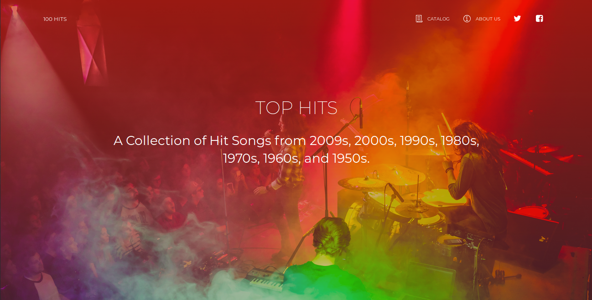
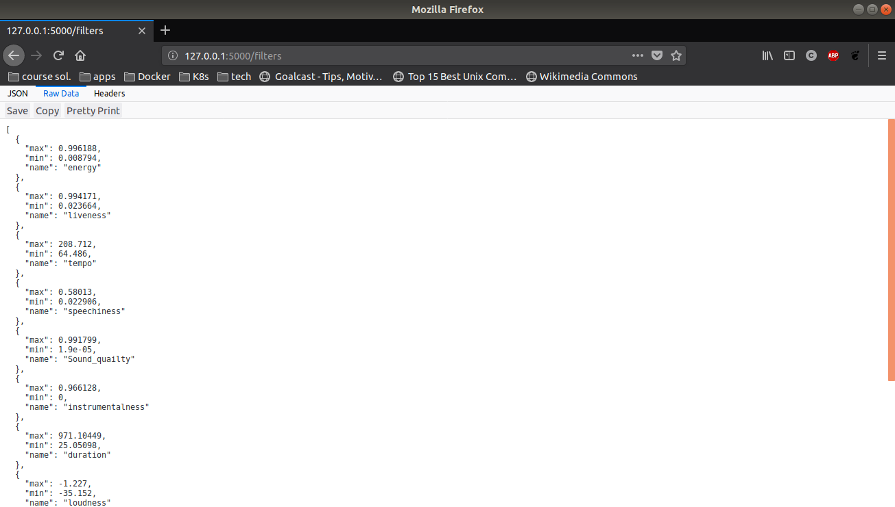
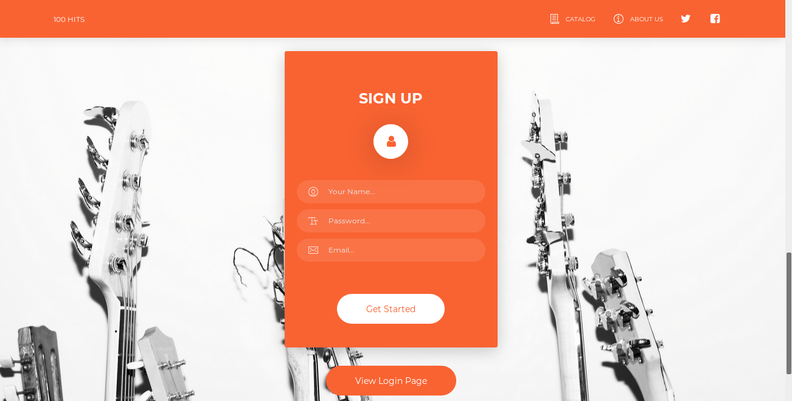
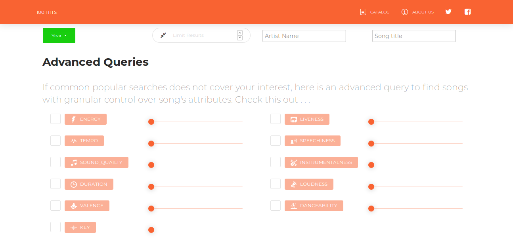
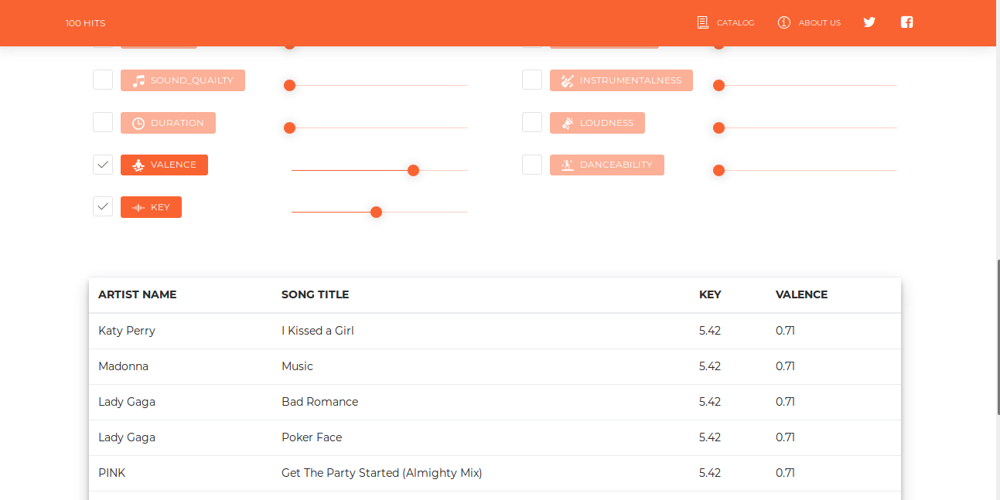

# TOP HITS
Large scale data driven application(LSDDA) course web application to search and query hit songs from 2009s, 2000s, 1990s, 1980s, 1970s, 1960s, and
1950s based on various song attributes such as sound quality, danceability, loudness, pleasentness etc.
### Features and Snapshots
+ This is our Home Page simple, elegent and awesome.

+ Implementation of REST api in Flask.

+ User account management.

+ A bunch of Filters to query database.

+ Advance queries with MongoDB Database and Ajax responsive design using JQuery.

### yeah !! pretty awesome right ? you are welcome :).
